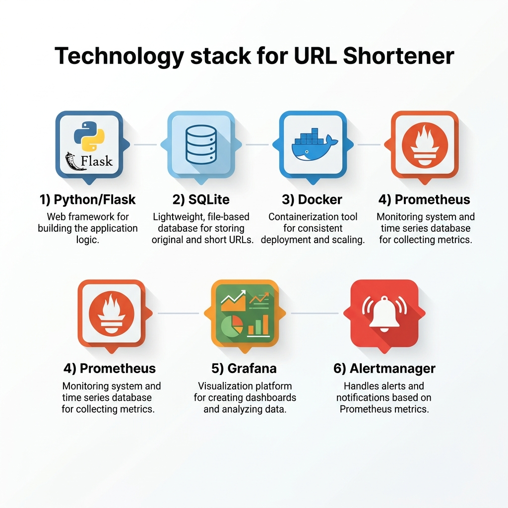
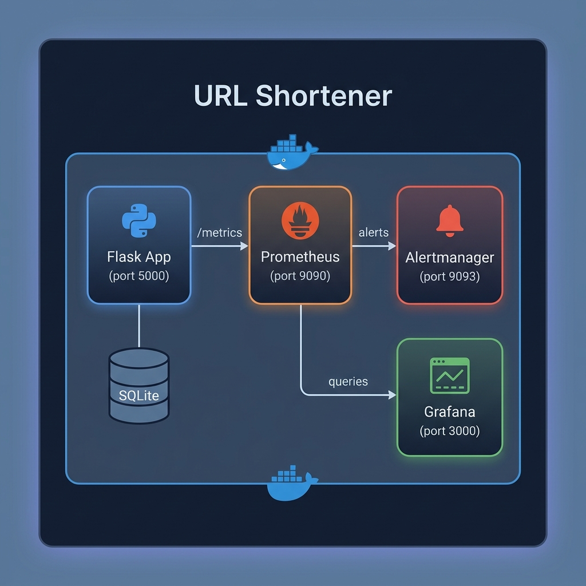
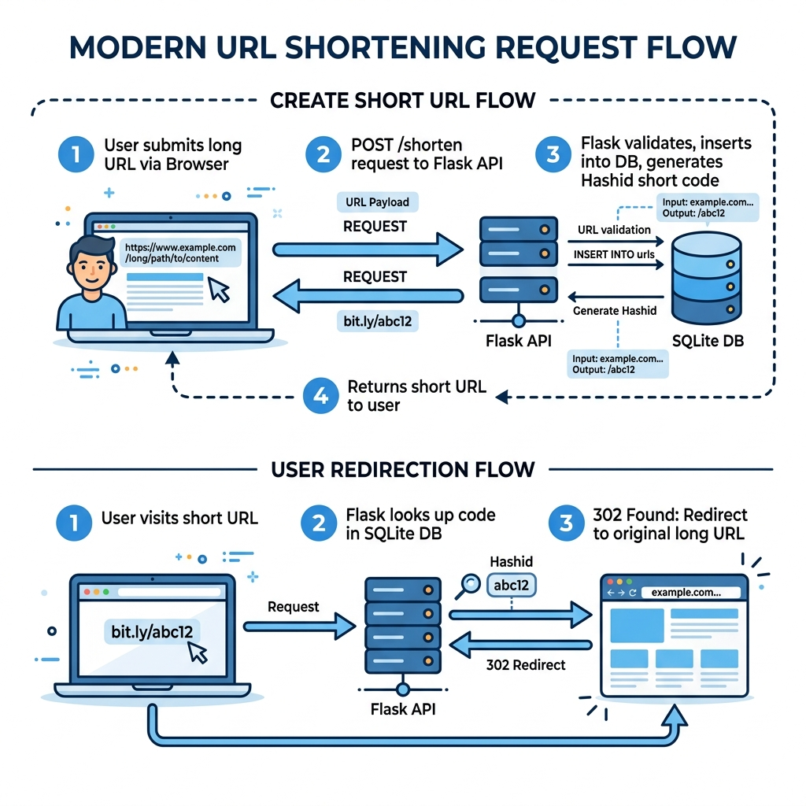
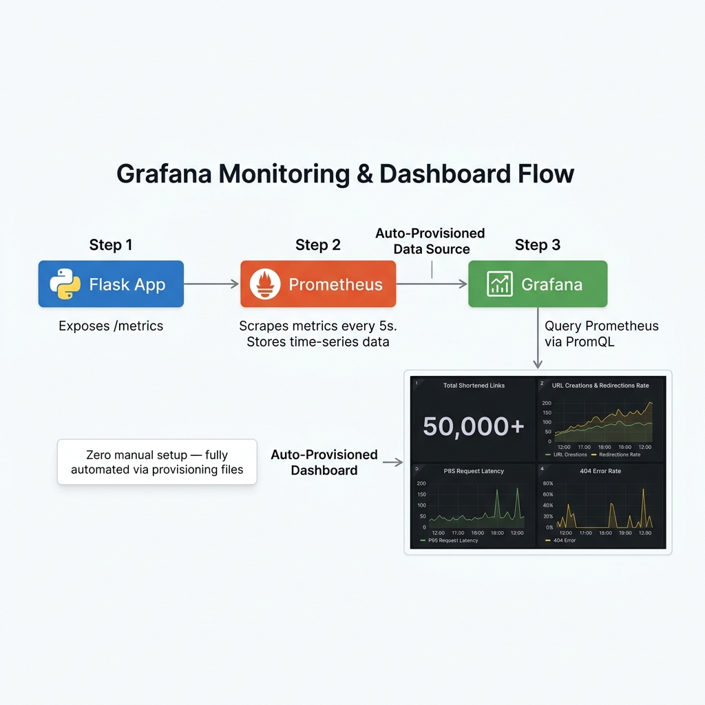
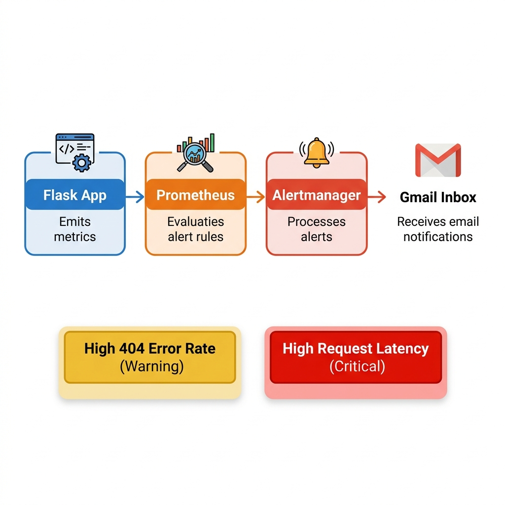

# Containerized URL Shortener Webservice

## A Production-Ready Microservice with Full Observability

---

## Agenda

1. Project Overview & Motivation
2. Technology Stack
3. System Architecture
4. How It Works — URL Shortening & Redirection
5. REST API Design
6. Containerization with Docker
7. Observability & Monitoring
8. Alerting Pipeline
9. Data Persistence Strategy
10. Live Demo
11. Future Improvements
12. Q&A

---

## Project Overview

### What is a URL Shortener?

A URL shortener converts long, unwieldy URLs into short, shareable links that redirect to the original destination.

**Example:**

| Before | After |
|--------|-------|
| `https://www.example.com/very/long/path/to/resource?with=many&query=params` | `http://localhost:5000/7vplvZ` |

### Why Build One?

- Understand **full-stack web development** end-to-end
- Practice **containerization** and **microservice orchestration**
- Implement **real-world monitoring & alerting** pipelines
- Build a **production-grade** project with proper DevOps practices

---

## Technology Stack



| Technology | Role | Why This Choice? |
|------------|------|------------------|
| **Python / Flask** | Web Framework | Lightweight, fast prototyping, built-in routing |
| **SQLite** | Database | Zero-config, file-based, perfect for single-instance services |
| **Hashids** | ID Encoding | Generates short, unique, non-sequential URL codes |
| **Docker** | Containerization | Consistent environments, easy deployment |
| **Docker Compose** | Orchestration | Multi-service management with a single command |
| **Prometheus** | Metrics Collection | Industry-standard time-series monitoring |
| **Grafana** | Visualization | Rich dashboards, auto-provisioned |
| **Alertmanager** | Alert Routing | Email notifications on critical thresholds |

---

## System Architecture



### Four Containerized Services

The entire stack runs via `docker compose` — one command to deploy everything:

```bash
docker compose up -d --build
```

| Service | Port | Responsibility |
|---------|------|----------------|
| **Flask App** | `5000` | REST API — shorten URLs, redirect, serve frontend |
| **Prometheus** | `9090` | Scrape metrics every 5s, evaluate alert rules |
| **Alertmanager** | `9093` | Route alerts, send email notifications via Gmail |
| **Grafana** | `3000` | Visualize metrics with pre-provisioned dashboards |

---

## How It Works — Shortening Flow



### Creating a Short URL

1. **User submits** a long URL via the web interface or API
2. **Flask validates** the URL (scheme, domain check)
3. **Inserts** the URL into the SQLite database
4. **Generates** a unique short code using Hashids (e.g., `7vplvZ`)
5. **Returns** the shortened URL to the user

### Redirecting

1. User visits `http://localhost:5000/<short_code>`
2. Flask **looks up** the code in the database
3. If found → **302 Redirect** to the original URL
4. If not found → **404 Error** (tracked as a metric)

---

## REST API Design

### Endpoints

| Method | Endpoint | Description |
|--------|----------|-------------|
| `GET` | `/` | Web interface (frontend) |
| `POST` | `/shorten` | Create a shortened URL |
| `GET` | `/<short_code>` | Redirect to original URL |
| `GET` | `/metrics` | Prometheus metrics endpoint |

### API Example — Shorten a URL

**Request:**
```bash
curl -X POST http://localhost:5000/shorten \
  -H "Content-Type: application/json" \
  -d '{"url": "https://www.google.com"}'
```

**Response:**
```json
{
  "short_url": "http://localhost:5000/7vplvZ"
}
```

### Input Validation & Error Handling

| Scenario | Status | Response |
|----------|--------|----------|
| Missing `url` field | `400` | `{"error": "Missing 'url' field"}` |
| Invalid scheme (no http/https) | `400` | `{"error": "URL must start with http:// or https://"}` |
| Missing domain | `400` | `{"error": "URL is missing a domain"}` |
| Unknown short code | `404` | `{"error": "Short URL not found"}` |

---

## Containerization with Docker

### Dockerfile — Multi-Layer Build

```dockerfile
FROM ubuntu:22.04

# System dependencies
RUN apt update && apt install -y python3 python3-pip

# Python dependencies
RUN pip install flask hashids prometheus_client

# Non-root user for security
RUN useradd kyrolles
RUN mkdir -p /opt/app/data && chown -R kyrolles:kyrolles /opt/app

USER kyrolles
WORKDIR /opt/app

COPY --chown=kyrolles:kyrolles . .

EXPOSE 5000

CMD ["python3", "app.py"]
```

### Key Docker Practices

- ✅ **Non-root user** (`kyrolles`) — reduced attack surface
- ✅ **Explicit port exposure** — documentation and clarity
- ✅ **File ownership** via `--chown` flag — proper permissions
- ✅ **Named volumes** — data persistence across restarts

---

## Docker Compose — Full Stack Orchestration

```yaml
services:
  url_shortener:
    build: .
    ports: ["5000:5000"]
    volumes:
      - db_shortener_url:/opt/app/data

  prometheus:
    image: prom/prometheus:v3
    ports: ["9090:9090"]
    volumes:
      - ./prometheus.yml:/etc/prometheus/prometheus.yml
      - ./rules.yml:/etc/prometheus/rules.yml
      - prometheus_data:/prometheus

  alertmanager:
    image: prom/alertmanager:v0.32.1
    ports: ["9093:9093"]

  grafana:
    image: grafana/grafana:13.0.1-security-01
    ports: ["3000:3000"]
    volumes:
      - ./grafana/provisioning:/etc/grafana/provisioning
      - ./grafana/dashboards:/var/lib/grafana/dashboards
      - grafana_data:/var/lib/grafana

volumes:
  db_shortener_url:
  prometheus_data:
  grafana_data:
```

---

## Observability & Monitoring

### Custom Prometheus Metrics

The Flask app exposes **4 custom metrics** at `/metrics`:

| Metric Name | Type | What It Tracks |
|-------------|------|----------------|
| `urls_shortened_total` | Counter | Total URLs successfully shortened |
| `redirects_total` | Counter | Total successful redirects |
| `failed_lookups_total` | Counter | Total 404 errors (invalid short codes) |
| `request_latency_seconds` | Histogram | Request duration per operation (shorten / redirect) |

### How Metrics Are Instrumented

```python
from prometheus_client import Counter, Histogram

URLS_SHORTENED = Counter('urls_shortened_total', 'Total URLs shortened')
FAILED_LOOKUPS = Counter('failed_lookups_total', 'Total 404 errors')
REQUEST_LATENCY = Histogram('request_latency_seconds', 
                            'Request latency', ['operation'])

@app.route("/shorten", methods=["POST"])
def shorten():
    with REQUEST_LATENCY.labels(operation='shorten').time():
        # ... business logic ...
        URLS_SHORTENED.inc()
```

---

## Grafana Dashboard — Monitoring Flow



### End-to-End Data Flow

| Step | Component | Action |
|------|-----------|--------|
| **1** | **Flask App** | Exposes custom metrics at `/metrics` endpoint |
| **2** | **Prometheus** | Scrapes the `/metrics` endpoint every **5 seconds** and stores time-series data |
| **3** | **Grafana** | Queries Prometheus via **PromQL** and renders real-time dashboard panels |

### Auto-Provisioned — Zero Manual Setup Required

Grafana is configured using **provisioning files** that automatically load:
- ✅ **Prometheus data source** — connected on first boot via `provisioning/datasources/prometheus.yml`
- ✅ **Pre-built dashboard** — "URL Shortener Overview" loaded from `grafana/dashboards/url_shortener.json`

### Dashboard Panels

| Panel | Visualization | PromQL Query |
|-------|---------------|--------------|
| **Total Shortened Links** | Single Stat | `urls_shortened_total` |
| **URL Creations & Redirections Rate** | Time Series | `rate(urls_shortened_total[1m])`, `rate(redirects_total[1m])` |
| **P95 Request Latency** | Time Series | `histogram_quantile(0.95, ...)` |
| **404 Error Rate** | Time Series | `rate(failed_lookups_total[1m])` |

---

## Alerting Pipeline



### Alert Flow

```
Flask App → /metrics → Prometheus (evaluates rules) → Alertmanager → Gmail Inbox
```

### Configured Alert Rules

| Alert Name | Condition | Duration | Severity |
|------------|-----------|----------|----------|
| **High404ErrorRate** | `rate(failed_lookups_total[5m]) > 0.1` req/s | 2 min | ⚠️ Warning |
| **HighRequestLatency** | Average latency `> 500ms` | 2 min | 🔴 Critical |

### Alertmanager Configuration

- **Delivery:** Gmail SMTP (`smtp.gmail.com:587`)
- **Grouping:** Alerts grouped by `alertname`
- **Repeat interval:** 4 hours (avoids alert fatigue)
- **Resolution notifications:** Enabled (`send_resolved: true`)

---

## Data Persistence Strategy

### Docker Named Volumes

All stateful data survives container restarts:

| Volume | Service | Data Stored |
|--------|---------|-------------|
| `db_shortener_url` | Flask App | SQLite database (all shortened URLs) |
| `prometheus_data` | Prometheus | Time-series metrics (TSDB) |
| `grafana_data` | Grafana | User settings, dashboard state |

### Lifecycle Commands

```bash
# Stop services — data is preserved
docker compose down

# Full reset — removes all data
docker compose down -v
```

---

## Frontend Interface

### Clean, Google-Inspired Design

The web interface features:
- 🎨 **Minimal, centered layout** — distraction-free UX
- 🔗 **One-click URL shortening** — paste and submit
- 📋 **Results table** — view all shortened links
- ⚡ **Async JavaScript** — no page reloads via `fetch()` API
- 💾 **Client-side persistence** — links stored in `localStorage`

### Key Frontend Code

```javascript
fetch('/shorten', {
  method: 'POST',
  headers: { 'Content-Type': 'application/json' },
  body: JSON.stringify({ url: longUrl })
})
.then(res => res.json())
.then(data => {
  // Add short URL to the results table
  table.style.display = 'table';
  tbody.prepend(newRow);
});
```

---

## Project Structure

```
URL_Shortener_v1/
├── app.py                     # Flask application + metrics
├── Dockerfile                 # Container image definition
├── docker-compose.yml         # Multi-service orchestration
├── prometheus.yml             # Prometheus scrape config
├── rules.yml                  # Alert rules (404s, latency)
├── alertmanager.yml           # Email notification config
├── requirements.txt           # Python dependencies
├── templates/
│   └── index.html             # Frontend web interface
├── static/
│   └── style.css              # CSS styling
└── grafana/
    ├── dashboards/
    │   └── url_shortener.json # Pre-built Grafana dashboard
    └── provisioning/
        ├── dashboards/
        │   └── dashboards.yml # Dashboard provisioning
        └── datasources/
            └── prometheus.yml # Datasource provisioning
```

---

## Service Access Points

| Service | URL | Credentials |
|---------|-----|-------------|
| **URL Shortener** | `http://localhost:5000` | — |
| **Prometheus** | `http://localhost:9090` | — |
| **Alertmanager** | `http://localhost:9093` | — |
| **Grafana** | `http://localhost:3000` | `admin` / `4kadmin` |

---

## Live Demo

### Demo Steps

1. **Start the stack:** `docker compose up -d --build`
2. **Open the web UI:** `http://localhost:5000`
3. **Shorten a URL** via the interface
4. **Click the short link** — verify redirect works
5. **Open Grafana:** `http://localhost:3000` — view metrics dashboard
6. **Open Prometheus:** `http://localhost:9090/alerts` — view alert status
7. **Test 404 alerting** — visit invalid short codes repeatedly

---

## Future Improvements

| Improvement | Description |
|-------------|-------------|
| 🔐 **Rate Limiting** | Prevent abuse with per-IP request throttling |
| 📊 **Click Analytics** | Track visit count, referrers, geographic data per link |
| ⏰ **Link Expiration** | Auto-expire links after a configurable TTL |
| 🔑 **User Authentication** | Personal dashboards and link management |
| 🐘 **PostgreSQL Migration** | Replace SQLite for multi-instance deployments |
| ☁️ **Cloud Deployment** | Deploy to AWS (ECS/Fargate or App Runner) |
| 🧪 **CI/CD Pipeline** | Automated testing and deployment via GitHub Actions |
| 📱 **QR Code Generation** | Generate QR codes for shortened links |

---

## Key Takeaways

- ✅ **Full-stack development** — Backend API + Frontend UI
- ✅ **Containerization** — Docker + Docker Compose for reproducible deployments
- ✅ **Observability** — Prometheus metrics + Grafana dashboards
- ✅ **Alerting** — Automated email notifications on critical thresholds
- ✅ **Data Persistence** — Docker volumes ensure data survives restarts
- ✅ **Production Practices** — Non-root containers, input validation, error handling

---

## Thank You! 🎉

### Questions?

**Project Repository:** URL_Shortener_v1

**Services at a Glance:**
- 🌐 App: `localhost:5000`
- 📊 Grafana: `localhost:3000`
- 🔥 Prometheus: `localhost:9090`
- 🔔 Alertmanager: `localhost:9093`
